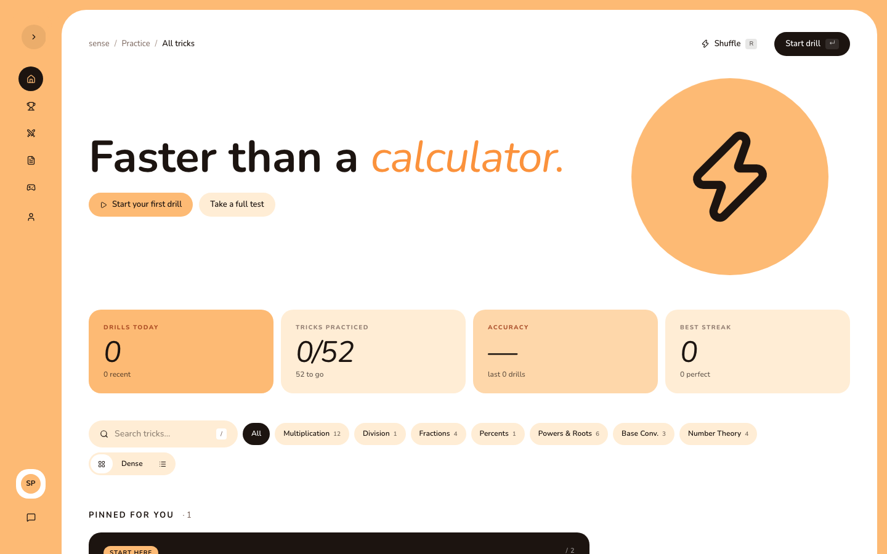
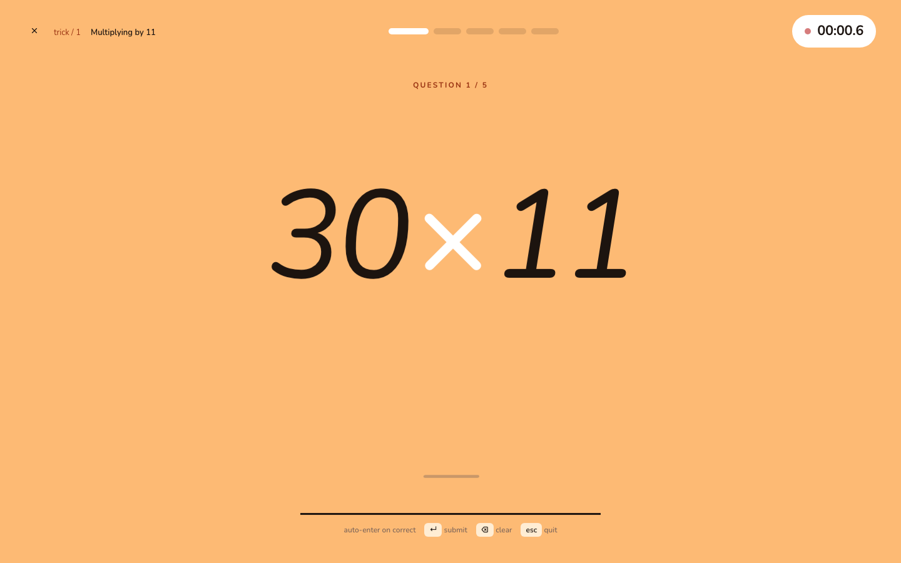
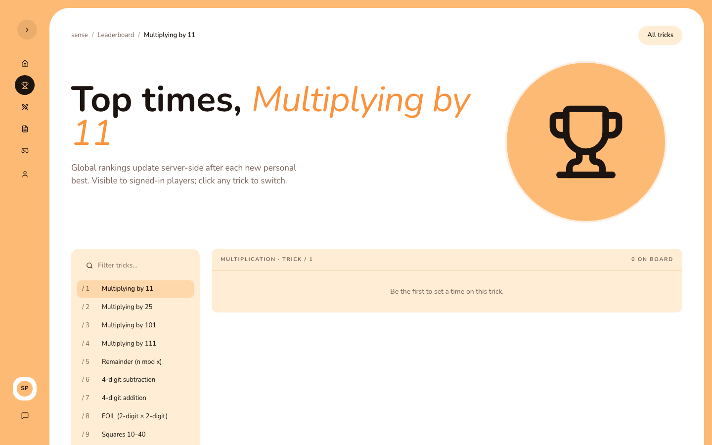
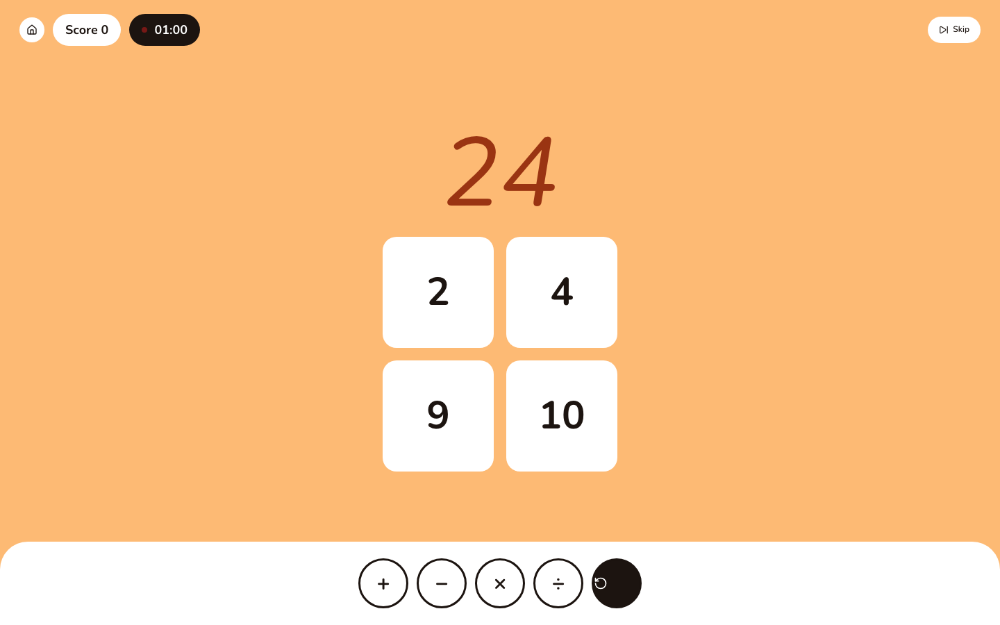
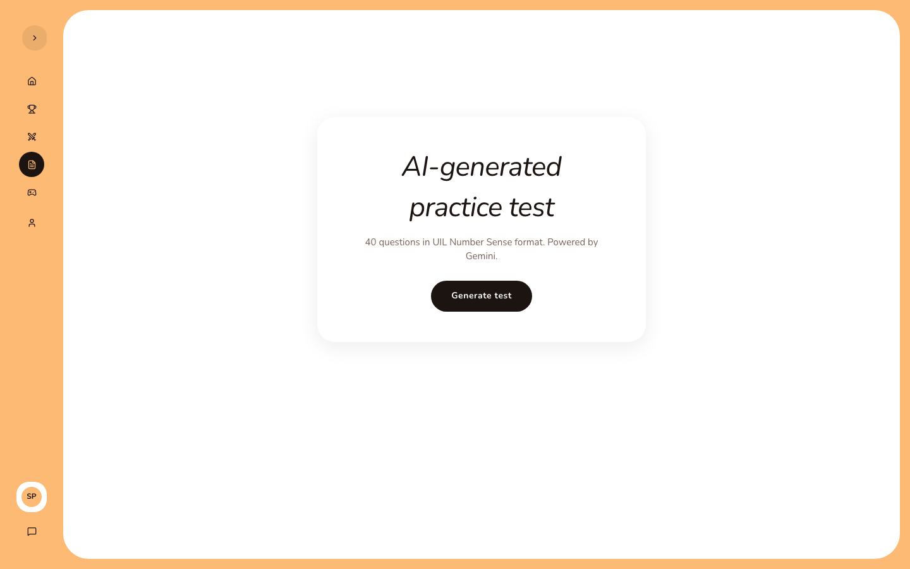
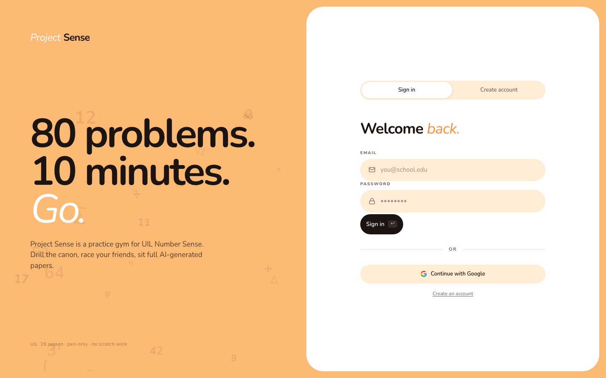

<p align="center">
  
</p>

<h1 align="center">Project Sense</h1>

<p align="center"><strong>A practice gym for UIL Number Sense</strong> — drill the canon, race your friends, and sit full-length AI-generated papers. Built for the pen-only mathlete.</p>

<p align="center">
  
  
  
  
  
</p>

> `PROJECT_CONTEXT.md` is the exhaustive source of truth (data model, security posture, cutover runbook, full session log). This README is the quick start.

---

## Features

- **Drills** — 52 canonical number-sense tricks with deterministic, seeded problems, a live timer, per-question breakdown, and personal bests.
- **Leaderboard** — global per-trick rankings, published server-side after a verified 5/5 run (login-gated reads).
- **Multiplayer** — real-time first-to-5 races over Firebase RTDB: public lobby or private code-invite rooms.
- **AI Test** — full 40-question UIL papers generated by Gemini (server-side) and graded locally.
- **Mini-games** — **Twenty-Four** (make 24 from four numbers) and **Zetamac** (rapid arithmetic drill).
- **Profile & achievements** — stats, weekly activity, strongest/weakest tricks.
- **Feedback** — an in-app "Send feedback" widget and a first-sign-in "what's new" note.
- **Public trick pages** — each `/trick/{id}` is server-rendered with how-to content + structured data for search engines; sign in to track your times.

## Screenshots

|  |  |
|---|---|
| **Home — 52-trick catalog** | **Timed drill** |
|  |  |
| **Leaderboard** | **Twenty-Four** |
|  |  |
| **AI-generated test** | **Sign in** |
|  |  |

<p align="center"><em>Screenshots are captured from the app on the Firebase emulator via <code>e2e/screenshots.spec.ts</code>.</em></p>

## Tech stack

Next.js 16 (App Router) · React 19 · TypeScript (strict) · Tailwind v4 · Nunito (single typeface) · Firebase Auth + Firestore + RTDB · `firebase-admin` (server) · Gemini (`@google/generative-ai`) · `fraction.js` · Vitest · Playwright · Vercel.

## Getting started

**Prerequisites:** Node `>=20.18`, and **pnpm via Corepack** — commands below use `corepack pnpm` (works without a global pnpm install). Behind a corporate SSL proxy, prefix Node/Firebase commands with `NODE_OPTIONS=--use-system-ca`.

```sh
corepack pnpm install
cp .env.local.example .env.local        # fill in your Firebase web config (see below)
corepack pnpm dev                        # http://localhost:3000
```

For a fully local stack, set `NEXT_PUBLIC_USE_EMULATOR=true` in `.env.local` and run the Firebase emulator in a second terminal:

```sh
corepack pnpm emulators                  # auth :9099 · firestore :8080 · rtdb :9000 · UI :4000
```

## Environment variables

See `.env.local.example` for the annotated list. Summary:

| Variable | Scope | Notes |
|---|---|---|
| `NEXT_PUBLIC_FIREBASE_*` (7) | public | Firebase web config (apiKey, authDomain, projectId, storageBucket, messagingSenderId, appId, databaseURL). `databaseURL` points at the app's RTDB instance. |
| `NEXT_PUBLIC_FIRESTORE_DATABASE_ID` | public | Named Firestore database for the app's isolated data (set to `prodsense` in deployed envs; unset uses the `(default)` database). |
| `NEXT_PUBLIC_FIREBASE_MEASUREMENT_ID` | public | Optional — enables GA4; no-ops when unset. |
| `NEXT_PUBLIC_SITE_URL` | public | Public origin for canonical/OG/sitemap. Defaults to the Vercel domain. |
| `NEXT_PUBLIC_USE_EMULATOR` | public | `true` routes the SDK to the local emulator. |
| `FIREBASE_SERVICE_ACCOUNT_KEY` | **server** | Admin SDK JSON (one line). Required for `/api/leaderboard`, `/api/feedback`. Never prefix with `NEXT_PUBLIC_`. |
| `GEMINI_API_KEY` | **server** | Required in production for `/api/generate-test`. |

## Scripts

| Command | What it does |
|---|---|
| `corepack pnpm dev` | Dev server (Turbopack). |
| `corepack pnpm build` / `start` | Production build / serve. |
| `corepack pnpm typecheck` | `tsc --noEmit`. |
| `corepack pnpm lint` | ESLint (Next core-web-vitals + TypeScript). |
| `corepack pnpm test` | Vitest unit suites (`__tests__/`). |
| `corepack pnpm test:rules` | Firestore + RTDB security-rules tests against the emulator (`rules-tests/`). |
| `corepack pnpm e2e` / `e2e:emulators` | Playwright specs (the `:emulators` variant wraps them in `firebase emulators:exec`). |
| `corepack pnpm emulators` | Firebase Local Emulator Suite. |

## Project structure

```
app/
  layout.tsx                 root layout (Nunito font, providers, metadata, JSON-LD)
  (auth)/login/              sign-in / register
  (app)/                     auth-gated app shell (sidebar + topbar)
    page.tsx                 home — 52-trick catalog
    drill/[trickId]/…        drill + results
    leaderboard, profile, multiplayer/…, test/, games/…
  trick/[trickId]/           PUBLIC, server-rendered trick pages (SEO)
  api/{leaderboard,generate-test,grade-test,feedback}/   server routes (Admin SDK, Gemini, rate-limited)
  error/global-error/not-found.tsx              error boundaries
  sitemap.ts, robots.ts
components/sense/             UI (Sidebar, TrickCard, DrillProblem, Room*, AITest*, Modal, FeedbackModal, …)
hooks/                       useAuth, useTweaks, useTimer, useRoom, useAITest, useTwentyFour, useFeedback, …
lib/
  config/site.ts             shared site URL / name
  data/                      tricks (52), categories, tips, achievements
  drill/                     problemGenerator, answerValidator (fraction.js), utils
  games/                     twentyFour, hands24, zetamac
  firebase/                  client, auth, drills, admin, leaderboard, profile, rooms, analytics, feedback
  server/                    aiTest, geminiKey, rateLimit, leaderboard, feedback, migration
__tests__/                   Vitest specs        rules-tests/   Firebase rules tests (emulator)
e2e/                         Playwright specs    scripts/       data migration + emulator seed
firebase.json, firestore.rules, database.rules.json
```

## Testing

The UI is responsive across desktop and phone layouts, with a persistent mobile navigation bar and viewport-safe drill, game, leaderboard, multiplayer, profile, and public pages.

- **Unit** (`corepack pnpm test`) — pure logic: problem generators, answer validator, games, migration, and API-route handlers.
- **Security rules** (`corepack pnpm test:rules`) — `@firebase/rules-unit-testing` against the emulator (auth gating, drill/room validation, private-room reads, server-only writes).
- **E2E** (`corepack pnpm e2e:emulators`) — Playwright drives register → drill → results → leaderboard against the emulator, and `e2e/screenshots.spec.ts` captures the README shots.

## Deployment

Hosted on **Vercel** — `main` is the production branch and auto-deploys on push. The app runs on an **isolated Firebase backend**: a dedicated Firestore database (`prodsense`) and RTDB instance (`prodsense-d63e1`) in the same project, selected via `NEXT_PUBLIC_FIRESTORE_DATABASE_ID` + the RTDB URL, so security rules and data are separated from any legacy deployment. Rules deploy with `firebase deploy --only firestore,database`. Full history and the cutover runbook live in `PROJECT_CONTEXT.md` and `CUTOVER.md`.
